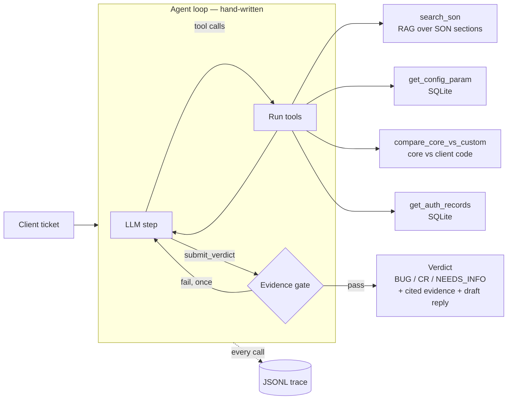

# FinReq Agent

**An agent that triages card-processing client tickets into BUG, CR or NEEDS_INFO — and has to prove it.**

When a bank's operations team raises a ticket, someone on the platform side has to decide: is this a defect in what we built, or a request for something that was never agreed? Getting it wrong is expensive in both directions. A false **BUG** sends engineers hunting a phantom; a false **CR** bills the client for our mistake.

FinReq Agent makes that call by reading the client's signed-off spec (Statement of Need), inspecting configuration, comparing core against client-custom code and querying authorisation records — then submitting a verdict that an **evidence gate** checks before it is accepted.

> All data is synthetic. "Northwind Bank", its SONs, config parameters, code and records are invented. No employer, client or card data is used.

---

## Results

16 hand-written cases (5 BUG · 6 CR · 5 NEEDS_INFO), Anthropic backend, retrieval mode.

| Metric | Run 1 | Run 2 |
|---|---:|---:|
| Verdict accuracy | 12% (2/16) | **88% (14/16)** |
| Majority-class baseline (always CR) | 38% | 38% |
| Evidence-anchor recall | 45% (9/20) | **87% (20/23)** |
| Grounded-citation rate | 100% | 100% |
| Runs needing a gate retry | 56% | 50% |
| Mean / p95 latency | 312s / 1677s | 88.5s / 111.9s |
| Cost per correct verdict | $0.369 | **$0.074** |

**Run 2 confusion matrix**

| expected \ predicted | BUG | CR | NEEDS_INFO |
|---|---:|---:|---:|
| **BUG** | 5 | 0 | 0 |
| **CR** | 0 | 4 | 2 |
| **NEEDS_INFO** | 0 | 0 | 5 |

### Reading it honestly

- **No false BUGs, and every defect was caught.** In this domain that is the error that matters most.
- **Both misses are the same shape:** a CR read as NEEDS_INFO (EV-009 retrospective fee refunds, EV-011 reissuing dispatched statements). In both, the agent retrieved and cited the correct out-of-scope clause, then declined to commit to the verdict that clause supports. The failure is caution, not misreading.
- **The loop is paying for correct answers.** 7 of 16 runs end on a guard (`gate_exhausted`, `step_budget`, `timeout`) rather than the agent deciding, and half need a gate retry. That is most of the cost and latency.
- **Retrieval is overfit.** The score floor was calibrated at 83% strict recall; on held-out queries it gives 60% strict recall (90% document recall), and the floor margin is now **−0.0155** — one irrelevant query outscores it. This was caught by a metric added for that purpose, before any accuracy number moved.
- **16 cases is small.** One flipped case moves accuracy by ~6 points. Treat the numbers as directional.

Full per-case reports: [`evals/results/run-1-anthropic-retrieval.md`](evals/results/run-1-anthropic-retrieval.md) · [`run-2`](evals/results/run-2-anthropic-retrieval.md)

### What moved run 1 → run 2

Run 1 collapsed at the evidence gate: correct reasoning, rejected citations. The fixes, in order:

1. **Normalisation** — quotes now fold markdown emphasis and JSON delimiters, so `**Age-based waivers.**` and `Age-based waivers.` match. Reworded quotes still fail.
2. **Citable comparisons** — `params_only_in_core`, the key finding for the main scenario, had no legal citation ref. It does now.
3. **Strict `submit_verdict`** — the model announced citations then sent none. The tool is now schema-validated by the API, with `evidence` placed before the prose fields and `minItems` set. Anchor recall on three check cases: 17% → 67%.
4. **Resolvable code refs** — bare filenames and `function/gloss` refs now resolve by exact basename match.

---

## Architecture



**The loop.** Up to 8 steps. The only sanctioned exit is `submit_verdict`; prose is never parsed into a verdict. Every other exit is a named guard (`step_budget`, `timeout`, `gate_exhausted`, `no_progress`, `tool_error_budget`), so "why did it stop?" always has an answer in the result and the trace.

**The evidence gate.** A BUG or CR needs at least two citations: at least one SON section, and at least one observed fact (config, code or data). A verdict resting only on the spec is a reading, not a triage. NEEDS_INFO must name what is missing. Every quote must appear in the *specific* tool result its ref points at — not merely somewhere in the run.

---

## Design decisions

| Decision | Why | Alternative rejected |
|---|---|---|
| Hand-written loop | The orchestration is the substance; it has to be defensible line by line | LangChain / agent frameworks hide stop logic and retries |
| One chunk per numbered SON section | 28 chunks total; section ids double as stable citation refs | Fixed-size splitter breaks clauses and citations |
| Calibrated score floor (0.63) | BGE scores sit in a narrow band (~0.60 even for unrelated text); a retriever that always returns something can't support "the spec is silent" | Intuitive floor like 0.3 admits everything |
| Floor set for zero false admits | An off-topic chunk above the floor becomes a quotable "requirement" → confident wrong verdict. A miss degrades to NEEDS_INFO, which is recoverable | Maximise recall |
| Citations grounded per ref | A quote that is real but from the wrong parameter's lookup survives review precisely because nothing is invented | Check quote against any tool result |
| Tools never raise | A tool fault costs a step, not the run. A miss (`not_found`) is well-formed and citable — it *is* the evidence for a CR | Exceptions into the loop |
| `instr` not `LIKE` for param lookup | `_` is a wildcard in LIKE; these names are made of underscores | SQL LIKE |
| Cost per *correct* verdict | A cheap wrong answer is not cheap | Cost per call |
| Report against majority baseline | "Always CR" already scores 38% | Headline accuracy alone |

---

## Quickstart

```bash
python -m venv .venv && source .venv/bin/activate   # Windows: .venv\Scripts\activate
pip install -r requirements.txt
python scripts/build_db.py                          # builds data/db.sqlite from seed.sql

pytest                                              # 114 offline tests, no API key needed

python -m src.rag reindex                           # chunk + embed the SONs (downloads the model once)
pytest -m integration                               # 16 tests; needs the index above
```

Triage one ticket (needs a real backend — the default `fake` is a scripted test double):

```bash
cp .env.example .env    # add ANTHROPIC_API_KEY for the real backend
python -m src.agent data/tickets/NWB-4471.json --backend anthropic
python -m src.trace     # summarise the newest trace
```

Run the evals:

```bash
python -m evals.run_evals --backend anthropic --mode retrieval
python -m evals.run_evals --retrieval-only        # retrieval report only, no LLM cost
```

Backends: `fake` (default; scripted responses for tests, not for triage) · `anthropic` · `ollama`, via `--backend` or `FINREQ_LLM`.

---

## Repository layout

```
data/sons/          3 fictional Statements of Need (ATM statements, fees, cycle dates)
data/code/core/     core-platform code samples
data/code/custom/   Northwind client-custom code samples
data/tickets/       demo tickets
data/seed.sql       config params + auth records
src/agent.py        the loop, guards, evidence-gate retry
src/tools.py        4 evidence tools + submit_verdict schema
src/rag.py          section chunking, fastembed (BGE-small), score floor
src/models.py       pydantic models, evidence gate, citation grounding
src/llm.py          fake / anthropic / ollama backends, cost estimate
src/trace.py        JSONL tracing + summariser
evals/              16 cases, harness, retrieval calibration, held-out queries, results
tests/              unit + integration tests
```

---

## Known limitations

- **Wall-clock guard only checks between steps.** One long API call can run past it — EV-004 took 801s against a 90s limit. This distorts latency figures; fix pending before further eval arms.
- **Retrieval floor is overfit** (negative margin on held-out queries). Needs recalibration on a larger query set.
- **Small eval set** (16 cases, 3 SONs, one fictional client).
- **Guards end too many runs** — 7/16 in run 2.
- **Data refs are weakly grounded** — auth-record citations can only be tied to "came from `get_auth_records`", not a specific row.

## Roadmap

- [ ] Fix the wall-clock guard (enforce a per-call timeout)
- [ ] Control arm: whole spec stuffed into context, no retrieval (`--mode stuffed`)
- [ ] Local-model arm via Ollama
- [ ] `POST /triage` FastAPI endpoint
- [ ] Larger eval set; recalibrate the retrieval floor on held-out data
